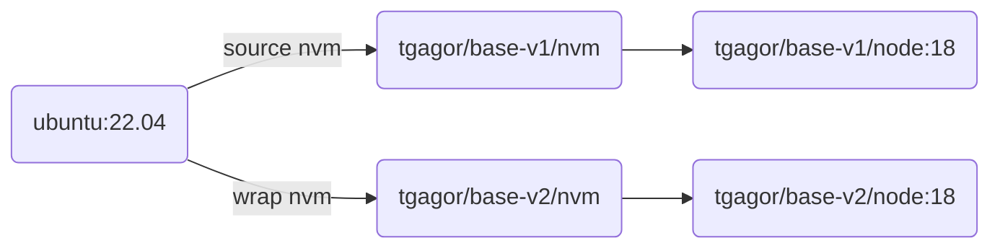

Two ways to integrate NVM in Docker images
==========================================

This is just an example of my approach to make NVM easily available in Docker images or CI/CD.

Hack used here allow to just copy your code to the Docker image and install whatever version of Node you need.

Explanation
-----------

The structure of Docker images:



All images are based on Ubunut 22.04 and install the same version of NVM.
- `tgagor/base-v1/*` images try to source `nvm.sh`,
- `tgagor/base-v2/*` images use wrappers (my preferred solution).

You can build all images calling:
```bash
make build
```

You can list them by:
```bash
make list
```

You can run tests by:
```bash
make test
```

Summing up the tests:
- v1 images can't call `node` without sourcing `nvm.sh` **each time** - so it's possible... but it's painful.
- v2 just works as it was running on your local machine.
